<p align="center">
  
</p>

<h1 align="center">Hi, I'm Hanawa.</h1>

<p align="center">
  <strong>I build AI products that turn ambitious ideas into useful software.</strong>
  <br />
  <sub>AI agents, creative workflows, and developer tools that are made to ship.</sub>
</p>

<p align="center">
  <a href="https://github.com/HanawaBanana?tab=followers">
    
  </a>
  
  
  
</p>

### Current transmission

```ts
const hanawa = {
  focus: [
    "AI products",
    "agent-powered workflows",
    "creative and developer tools",
  ],
  operatingMode: {
    default: "useful > impressive",
    finish: "shipped > perfect",
  },
};
```

### What I build

> **`SIGNAL 01` - AI product systems**
>
> Agent workflows, model integrations, and the product layers that make AI useful in practice.

> **`SIGNAL 02` - AI media workflows**
>
> Tools for turning stories, prompts, and creative direction into consistent visual output.

> **`SIGNAL 03` - Developer tools and data products**
>
> Focused software that makes complex data, research, and everyday workflows easier to use.

### Selected work

| Project | What it is | Link |
| --- | --- | --- |
| **ArcReel** | Exploring an open-source AI video workspace for story-to-video production and cross-shot consistency. | [arc-reel.com](https://arc-reel.com) |
| **Chat2DB** | Working with an AI-first database and SQL client across popular database engines. | [chat2db.ai](https://chat2db.ai) |
| **China Model Rank** | A model comparison product for rankings, benchmarks, and user reputation signals. | [Live project](https://page.far-domain.top/china-model-rank/) |
| **Music Radio** | A small, focused web experiment for music discovery and listening. | [Repository](https://github.com/HanawaBanana/music-radio) |
| **Jingcai H5** | An independent mobile web interface experiment. | [Repository](https://github.com/HanawaBanana/jingcai-fronted-h5) |

### Toolbox

<p align="center">
  
</p>

### Contribution signal

<picture>
  <source media="(prefers-color-scheme: dark)" srcset="https://raw.githubusercontent.com/HanawaBanana/HanawaBanana/output/github-contribution-grid-snake-dark.svg" />
  <source media="(prefers-color-scheme: light)" srcset="https://raw.githubusercontent.com/HanawaBanana/HanawaBanana/output/github-contribution-grid-snake.svg" />
  
</picture>

<p align="center">
  <a href="https://github.com/HanawaBanana">Find me on GitHub</a>
  <br />
  <sub>Make it useful. Make it clear. Ship it.</sub>
</p>
